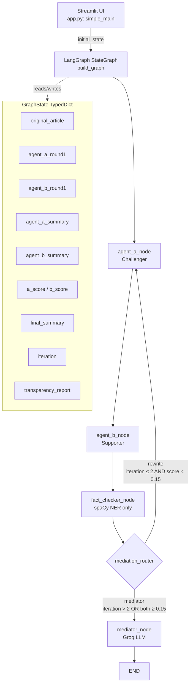

# Design Document

## Fact-Grounded Multi-Agent Debate

---

## Overview

The Fact-Grounded Multi-Agent Debate system is a single-file Python application (`app.py`) that orchestrates two adversarial LLM agents through a LangGraph `StateGraph` pipeline. Given a news article (pasted text or fetched from a URL), the pipeline runs:

1. **Agent A (Challenger)** — critically challenges the article's claims
2. **Agent B (Supporter)** — advocates for the article's core facts
3. **Fact-Checker** — scores both summaries using spaCy NER and the Authority Score formula (no LLM)
4. **Rewrite Loop** — if either score is below threshold and iterations remain, routes back to Agent A for a Round 2 refinement pass
5. **Mediator** — synthesizes a final 200-word neutral summary weighted by Authority Scores and emits a Transparency Report

The UI is a Streamlit 3-column layout. All LLM calls use Groq API (ChatGroq). The architecture is intentionally kept as a single file for academic clarity.

### Key Design Decisions

- **Single-file architecture**: All logic lives in `app.py`. No module splitting is needed for this academic project.
- **GraphState TypedDict**: Adds `agent_a_round1`, `agent_b_round1`, and `transparency_report` fields missing from the original implementation.
- **Authority Score formula**: `A_s = (E_cited / E_total) + 0.1 * C_score`, clamped to [0, 1]. The original code omitted the `0.1 * C_score` coherence term.
- **Round 1 vs Round 2 agent behavior**: Agents check `iteration == 0` to decide whether to write to `*_round1` or `*_summary` fields, and whether to include the opponent's output in their prompt.
- **Mediator fallback**: If `agent_a_summary` is empty (no Round 2 occurred), the Mediator falls back to `agent_a_round1` / `agent_b_round1`.
- **Streamlit session_state accumulation**: The center column uses `st.session_state` to accumulate a list of debate log entries rather than overwriting a single placeholder, fixing the streaming update bug.
- **URL fetching**: `requests.get` with a 10-second timeout; basic text extraction strips HTML tags using a simple regex or `html.parser`.
- **GROQ_MODEL env var**: Read at startup with `os.getenv("GROQ_MODEL", "llama-3.1-8b-instant")` fallback.
- **GROQ_API_KEY validation**: Checked at startup before rendering the input form; displays a `st.error` and `st.stop()` if missing.

---

## Architecture



The graph is compiled once at module load (`graph = build_graph()`). Each `streamlit run` session calls `graph.stream(initial_state, stream_mode="updates")` which yields per-node update dicts that the UI processes incrementally.

---

## Components and Interfaces

### `GraphState` (TypedDict)

```python
class GraphState(TypedDict):
    original_article: str       # Raw article text (from textarea or URL fetch)
    agent_a_round1: str         # Agent A's first-pass output (iteration == 0)
    agent_b_round1: str         # Agent B's first-pass output (iteration == 0)
    agent_a_summary: str        # Agent A's refined output (iteration > 0), or empty
    agent_b_summary: str        # Agent B's refined output (iteration > 0), or empty
    a_score: float              # Agent A's Authority Score after Fact-Checker
    b_score: float              # Agent B's Authority Score after Fact-Checker
    final_summary: str          # Mediator's final neutral synthesis
    iteration: int              # Incremented by Fact-Checker each pass
    transparency_report: dict   # Computed by Mediator; see Data Models
```

### `get_llm() -> ChatGroq`

Returns a `ChatGroq` instance using `GROQ_MODEL` env var (default `llama-3.1-8b-instant`) and `temperature=0.7`. Called inside each LLM node to avoid holding a stale connection.

### `load_spacy() -> spacy.Language`

Decorated with `@st.cache_resource`. Loads `en_core_web_md`; auto-downloads if missing. Returns the cached model used by `fact_checker_node`.

### `fetch_article(url: str) -> tuple[str, str | None]`

Performs `requests.get(url, timeout=10)`. Returns `(text, None)` on success or `("", error_message)` on failure. Extracts visible text from HTML using `html.parser` (`HTMLParser` subclass that strips tags). Called from the UI layer before invoking the graph.

### `agent_a_node(state: GraphState) -> dict`

- If `state["iteration"] == 0`: builds a Round 1 challenger prompt with only `original_article`; stores result in `agent_a_round1`.
- If `state["iteration"] > 0`: builds a Round 2 prompt including `agent_b_round1`, `a_score`, `b_score`; stores result in `agent_a_summary`.

### `agent_b_node(state: GraphState) -> dict`

Mirror of `agent_a_node`. Round 1 stores to `agent_b_round1`; Round 2 stores to `agent_b_summary` and includes `agent_a_round1` in context.

### `fact_checker_node(state: GraphState) -> dict`

Pure Python + spaCy. Computes Authority Scores for both agents. Returns `{a_score, b_score, iteration: state["iteration"] + 1}`.

### `mediation_router(state: GraphState) -> str`

Returns `"rewrite"` or `"mediator"` based on iteration and score thresholds.

### `mediator_node(state: GraphState) -> dict`

Reads summaries (with round1 fallback), builds authority-weighted synthesis prompt, calls Groq LLM, computes `transparency_report`, returns `{final_summary, transparency_report}`.

### `build_graph() -> CompiledGraph`

Wires all nodes and edges. Entry point: `agent_a`. Conditional edges from `fact_checker`.

### `simple_main()`

Streamlit UI entry point. Validates API key, renders 3-column layout, streams graph events, accumulates debate log in `st.session_state["debate_log"]`.

---

## Data Models

### Initial State (passed to `graph.stream`)

```python
initial_state = {
    "original_article": article_text,
    "agent_a_round1": "",
    "agent_b_round1": "",
    "agent_a_summary": "",
    "agent_b_summary": "",
    "a_score": 0.0,
    "b_score": 0.0,
    "final_summary": "",
    "iteration": 0,
    "transparency_report": {},
}
```

### Transparency Report (dict)

```python
{
    "a_score": float,           # Agent A's final Authority Score
    "b_score": float,           # Agent B's final Authority Score
    "iteration": int,           # Total Fact-Checker passes completed
    "dominant_agent": str,      # "Challenger", "Supporter", or "Equal Contribution"
    "score_delta": float,       # abs(a_score - b_score)
}
```

### Authority Score Formula

```
A_s = clamp((E_cited / E_total) + ω * C_score, 0.0, 1.0)

where:
  E_cited  = |{e ∈ E_total_set : e appears (case-insensitive) in summary}|
  E_total  = |E_total_set|
  C_score  = |{s ∈ sentences(summary) : ∃ e ∈ E_total_set, e in s.lower()}| / |sentences(summary)|
  ω        = 0.1
  sentences = summary.split(".")  (non-empty segments only)
```

If `E_total == 0`, both scores default to `1.0` (no entities to check against).

### Streamlit Session State

```python
st.session_state["debate_log"]  # list[dict] — accumulated per-node events
# Each entry: {"node": str, "data": dict}
```

The center column iterates this list on each rerender to display all events in order, fixing the overwrite bug in the original implementation.

---

## Correctness Properties

*A property is a characteristic or behavior that should hold true across all valid executions of a system — essentially, a formal statement about what the system should do. Properties serve as the bridge between human-readable specifications and machine-verifiable correctness guarantees.*

### Property 1: Authority Score is always in [0, 1]

*For any* article text and summary text (including empty strings and edge cases), the computed `Authority_Score` SHALL be in the closed interval [0.0, 1.0].

**Validates: Requirements 5.9**

---

### Property 2: Authority Score idempotence

*For any* article text and summary text, calling `fact_checker_node` twice with the same inputs SHALL produce identical `a_score` and `b_score` values.

**Validates: Requirements 5.12, 12.2**

---

### Property 3: E_cited never exceeds E_total

*For any* article text and summary text, the computed `E_cited` value SHALL be less than or equal to `E_total`.

**Validates: Requirements 5.6**

---

### Property 4: C_score is always in [0, 1]

*For any* summary text with at least one non-empty sentence, the computed `C_score` SHALL be in the closed interval [0.0, 1.0].

**Validates: Requirements 5.7**

---

### Property 5: Routing correctness — rewrite condition

*For any* GraphState where `iteration ≤ 2` AND (`a_score < 0.15` OR `b_score < 0.15`), `mediation_router` SHALL return `"rewrite"`.

**Validates: Requirements 6.2**

---

### Property 6: Routing correctness — mediator condition

*For any* GraphState where `iteration > 2` OR (`a_score ≥ 0.15` AND `b_score ≥ 0.15`), `mediation_router` SHALL return `"mediator"`.

**Validates: Requirements 6.3**

---

### Property 7: Agent A Round 1 stores to agent_a_round1

*For any* article text, when `agent_a_node` is called with `iteration == 0`, the returned dict SHALL set `agent_a_round1` to the LLM response and SHALL NOT set `agent_a_summary`.

**Validates: Requirements 3.4**

---

### Property 8: Agent A Round 2 stores to agent_a_summary

*For any* GraphState with `iteration > 0`, when `agent_a_node` is called, the returned dict SHALL set `agent_a_summary` to the LLM response and SHALL NOT modify `agent_a_round1`.

**Validates: Requirements 3.6**

---

### Property 9: Mediator fallback uses round1 when summary is empty

*For any* GraphState where `agent_a_summary` is empty, the prompt constructed by `mediator_node` SHALL contain the content of `agent_a_round1` (and similarly `agent_b_round1` for Agent B).

**Validates: Requirements 7.2**

---

### Property 10: Transparency report dominant_agent correctness

*For any* `a_score` and `b_score`, the `dominant_agent` field in `transparency_report` SHALL be `"Challenger"` when `a_score > b_score`, `"Supporter"` when `b_score > a_score`, and `"Equal Contribution"` when `a_score == b_score`.

**Validates: Requirements 7.7, 9.4, 9.5**

---

### Property 11: Transparency report score_delta correctness

*For any* `a_score` and `b_score`, the `score_delta` field in `transparency_report` SHALL equal `abs(a_score - b_score)`.

**Validates: Requirements 7.7, 9.7**

---

### Property 12: URL fetch failure does not invoke pipeline

*For any* HTTP status code that is not 200, `fetch_article` SHALL return a non-empty error string and the pipeline SHALL NOT be invoked.

**Validates: Requirements 1.4**

---

### Property 13: Case-insensitive entity matching

*For any* entity string `e` in `E_total_set`, if `e.upper()` or any mixed-case variant appears in the summary, it SHALL be counted as a match (i.e., the match count is the same regardless of case variation in the summary).

**Validates: Requirements 12.3**

---

### Property 14: Iteration increments by exactly 1 per Fact-Checker pass

*For any* initial `iteration` value `n`, after `fact_checker_node` completes, the `iteration` field in the returned dict SHALL equal `n + 1`.

**Validates: Requirements 5.11**

---

## Error Handling

| Scenario | Handler | Behavior |
|---|---|---|
| `GROQ_API_KEY` missing or empty | `simple_main` startup | `st.error(...)` + `st.stop()` — form never rendered |
| URL fetch returns non-200 | `fetch_article` | Returns `("", error_msg)`; UI shows error, pipeline not invoked |
| URL fetch raises `requests.exceptions.RequestException` | `fetch_article` | Catches exception, returns `("", str(e))` |
| Both input fields empty | `simple_main` button handler | `st.warning(...)`, pipeline not invoked |
| Groq API error in any LLM node | Node function | Exception propagates; caught by `try/except` in `simple_main`, displayed via `st.error` |
| spaCy model not installed | `load_spacy` | Auto-downloads via `spacy.cli.download` before loading |
| `E_total == 0` (no entities in article) | `fact_checker_node` | Both scores set to `1.0`; pipeline continues normally |
| `iteration > 2` with low scores | `mediation_router` | Forces `"mediator"` route regardless of scores |

---

## Testing Strategy

### Approach

This feature uses a **dual testing approach**:

- **Unit tests** for specific examples, edge cases, and error conditions
- **Property-based tests** for universal correctness properties (using [Hypothesis](https://hypothesis.readthedocs.io/))

LLM calls are mocked in all unit and property tests using `unittest.mock.patch`. spaCy is used directly (no mock) in Fact-Checker tests since it is a deterministic local model.

### Property-Based Testing Library

**Hypothesis** (Python) — `pip install hypothesis`

Each property test runs a minimum of **100 iterations** (configured via `@settings(max_examples=100)`).

Tag format in test comments: `Feature: fact-grounded-multi-agent-debate, Property {N}: {property_text}`

### Test File Structure

```
tests/
  test_fact_checker.py     # Properties 1–4, 13, 14 + edge cases
  test_routing.py          # Properties 5–6
  test_agents.py           # Properties 7–8 (mocked LLM)
  test_mediator.py         # Properties 9–11 (mocked LLM)
  test_url_fetch.py        # Property 12 + edge cases
  test_ui_smoke.py         # Smoke tests: API key validation, graph wiring
```

### Property Test Examples

```python
# Feature: fact-grounded-multi-agent-debate, Property 1: Authority Score is always in [0, 1]
@given(article=text(), summary=text())
@settings(max_examples=100)
def test_authority_score_clamped(article, summary):
    state = make_state(original_article=article, agent_a_summary=summary, agent_b_summary=summary)
    result = fact_checker_node(state)
    assert 0.0 <= result["a_score"] <= 1.0
    assert 0.0 <= result["b_score"] <= 1.0

# Feature: fact-grounded-multi-agent-debate, Property 5: Routing correctness — rewrite condition
@given(
    iteration=integers(min_value=0, max_value=2),
    a_score=floats(min_value=0.0, max_value=0.149),
    b_score=floats(min_value=0.0, max_value=1.0),
)
@settings(max_examples=100)
def test_router_rewrite_condition(iteration, a_score, b_score):
    state = make_state(iteration=iteration, a_score=a_score, b_score=b_score)
    assert mediation_router(state) == "rewrite"
```

### Unit Test Coverage

- `fetch_article`: 200 OK, 404, 500, connection error, empty body
- `agent_a_node` / `agent_b_node`: Round 1 field assignment, Round 2 field assignment, prompt content
- `mediator_node`: fallback to round1, transparency_report structure, dominant_agent logic
- `simple_main`: API key missing → `st.stop()`, empty input → no pipeline invocation
- `load_spacy`: cache hit (called once), auto-download path

### Integration Tests

- Full graph run with mocked Groq LLM: verify all GraphState fields populated after `graph.stream` completes
- Rewrite loop: verify graph routes back to `agent_a` when scores are low, then proceeds to mediator
- State field preservation across rewrite loop (LangGraph merge behavior)
